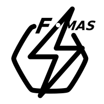

<!--- ---------------------------------------------
Copyright (C) 2021 Andrei Olaru.

This file is part of Flash-MAS. The CONTRIBUTORS.md file lists people who have been previously involved with this project.

Flash-MAS is free software: you can redistribute it and/or modify it under the terms of the GNU General Public License as published by the Free Software Foundation, either version 3 of the License, or any later version.

Flash-MAS is distributed in the hope that it will be useful, but WITHOUT ANY WARRANTY; without even the implied warranty of MERCHANTABILITY or FITNESS FOR A PARTICULAR PURPOSE.  See the GNU General Public License for more details.

You should have received a copy of the GNU General Public License along with Flash-MAS.  If not, see <http://www.gnu.org/licenses/>.
--------------------------------------------- -->

# FLASH-MAS

The Fast Lightweight Agent Shell MAS framework

***Easy for beginners, powerful to experts***

## Intro

FLASH-MAS implements a model based on generic *entities*, which could be agents, agent groups, nodes, communication infrastructure elements, or agent components.

FLASH-MAS is supposed to become compatible with other models and infrastructures, such as JADE or JaCaMo, and be a valid choice for ABMS simulations, by modularizing infrastructure services so that agents don't need code changes when changing communication or deployment infrastructure.

There are several targets that should make FLASH-MAS a good option for MAS developers, and these are also its main features:

* system model -- the way the entities in the system are structured and the way in which they interact
* deployment and configuration -- the way one specifies a deployment; the way in which this deployment is loaded
* dynamics -- how entities in the system can be reconfigured at runtime, supporting open and heterogeneous systems
* portability -- the code for most of the core of FLASH-MAS is portable
* tools -- tools are offered to be able to monitor and control the system

## Phases

The current phase of FLASH-MAS (branch `master`) uses  an older type of entities, which interact by means of references and proxies -- call this **Nested-entity model**

The future phase of FLASH-MAS uses the ***entity-operation*** model, in which entities interact only via the framework.

## Understanding FLASH-MAS

Deploying a FLASH-MAS system means creating a *deployment configuration* specifying the *entities* in the system, and *booting the system*.

* [Basic F-MAS concepts](doc/concepts.md) 

* [Interaction between entities](doc/interaction.md)

* [Loading entities and booting the system](doc/loading.md)

* [Deployment and configuration](doc/deployment.md)

* [Running](doc/running.md)

* [other remarks](doc/other.md) 

* older [notes file](doc/notes.md)

## Source documentation

[Javadoc here](doc/javadoc/index.html)

## Source organization

* `src` contains sources for FLASH-MAS functionality and for the `quick` package which enables quicker writing of CLI commands (see [running](doc/running.md)).
* `src-examples` contain sources for examples of FLASH-MAS deployments.
* `src-tests` contains test to check the correct working of the framework.
* `src-testing` contains sources for the ongoing work of various developers
* `src-schema` contains the schema for XML deployment files
* `doc` contains documentation markdown pages and javadoc
* `identity` contains visual identity information (e.g. the logo)
* `lib` contains necessary libraries

## License

FLASH-MAS is licensed under GPL v3.

A lot of people contributed to FLASH-MAS throughout its life: [Contributors](CONTRIBUTORS.md)
