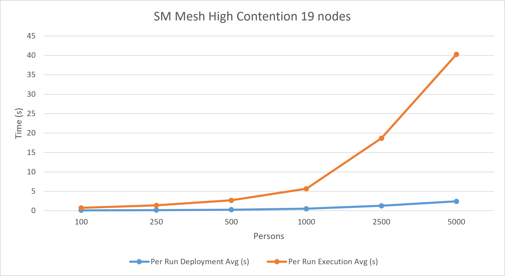
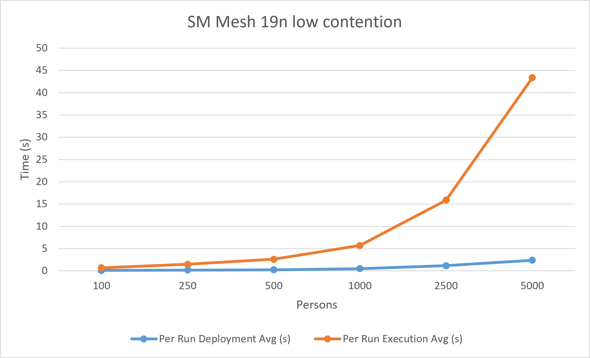
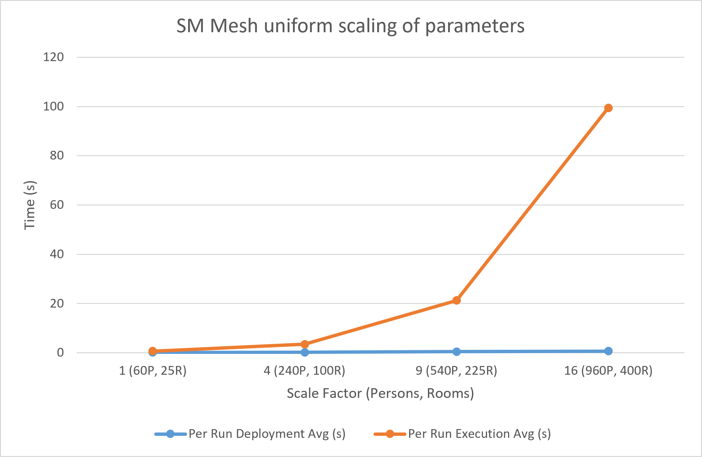
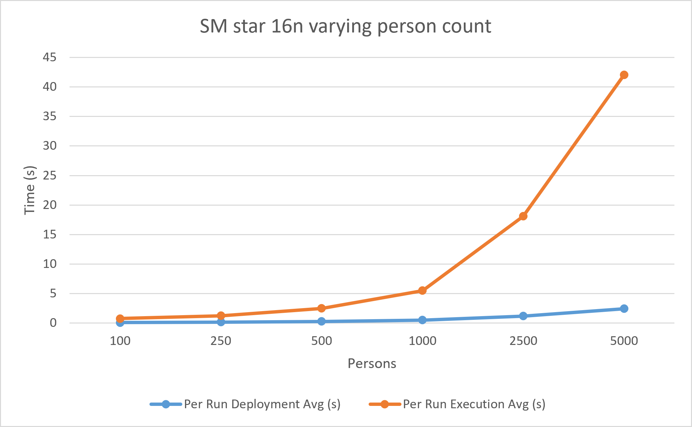

# SmartMeeting ABMS Performance & Benchmarking Results

This document presents the experimental results of the SmartMeeting Agent-Based Modeling and Simulation (ABMS) system. The benchmarks evaluate the system's performance across different topological structures (Mesh vs. Star), contention levels, and uniform scaling factors.

All tests were run over 50,000 steps per iteration to ensure stable execution averages.

## 1. Mesh Topology: 19-Node Scenario
The 19-node mesh topology was tested under two different demand constraints: Low Contention (relaxed request windows) and High Contention (dense, simultaneous request bursts).

### High Contention

Under high contention, the execution time grows drastically as the number of concurrent person agents increases.

| Scenario | Per Run Deployment Avg (s) | Per Run Execution Avg (s) | Per Run Total Avg (s) | Nr. Persons |
| :--- | :--- | :--- | :--- | :--- |
| sm-mesh-19n-100Person | 0.11 | 0.74 | 0.86 | 100 |
| sm-mesh-19n-250Person | 0.16 | 1.38 | 1.56 | 250 |
| sm-mesh-19n-500Person | 0.27 | 2.7 | 2.99 | 500 |
| sm-mesh-19n-1000Person | 0.51 | 5.68 | 6.2 | 1000 |
| sm-mesh-19n-2500Person | 1.29 | 18.68 | 19.99 | 2500 |
| sm-mesh-19n-5000Person | 2.41 | 40.25 | 42.68 | 5000 |

### Low Contention

Low contention scenarios show slightly better execution stability, as the requests are spread over a wider temporal window, reducing the simultaneous queue depth at the auctioneer level.

| Scenario | Per Run Deployment Avg (s) | Per Run Execution Avg (s) | Total Avg (s) | Nr. Persons |
| :--- | :--- | :--- | :--- | :--- |
| sm-mesh-19n-100Person | 0.1 | 0.7 | 0.81 | 100 |
| sm-mesh-19n-250Person | 0.19 | 1.5 | 1.7 | 250 |
| sm-mesh-19n-500Person | 0.27 | 2.61 | 2.89 | 500 |
| sm-mesh-19n-1000Person | 0.51 | 5.7 | 6.22 | 1000 |
| sm-mesh-19n-2500Person | 1.16 | 15.9 | 17.07 | 2500 |
| sm-mesh-19n-5000Person | 2.41 | 43.35 | 45.78 | 5000 |

## 2. Uniform Scaling (Persons & Rooms)

This benchmark evaluates the engine's performance when uniformly scaling both the infrastructure (rooms) and the agent population (persons) using a predefined multiplier.

| Scenario | Per Run Deployment Avg (s) | Per Run Execution Avg (s) | Per Run Total Avg (s) | Scale |
| :--- | :--- | :--- | :--- | :--- |
| sm-mesh-scale1 | 0.09 | 0.64 | 0.74 | 1 (60P, 25R) |
| sm-mesh-scale4 | 0.21 | 3.45 | 3.68 | 4 (240P, 100R) |
| sm-mesh-scale9 | 0.43 | 21.23 | 21.68 | 9 (540P, 225R) |
| sm-mesh-scale16 | 0.65 | 99.43 | 100.11 | 16 (960P, 400R) |

**Performance Note:** Scaling both the agent count and the topological complexity simultaneously results in an exponential growth in execution time. While deployment remains fast and linear (staying under 1 second), the execution time jumps significantly due to the massive increase in route calculations and feasibility checks per auction.

## 3. Topology Comparison: Star vs. Mesh

To isolate the impact of network topology on overall simulation speed, a pure Star topology (a central hub directly connected to 15 heterogeneous rooms) was benchmarked against the Mesh topology. Both utilized a single central Auctioneer and up to 5000 Person agents.

| Scenario | Per Run Deployment Avg (s) | Per Run Execution Avg (s) | Total Avg (s) | Nr. Persons |
| :--- | :--- | :--- | :--- | :--- |
| sm-star-16n-HC-100P | 0.1 | 0.76 | 0.87 | 100 |
| sm-star-16n-HC-250P | 0.17 | 1.25 | 1.43 | 250 |
| sm-star-16n-HC-500P | 0.28 | 2.51 | 2.8 | 500 |
| sm-star-16n-HC-1000P | 0.51 | 5.51 | 6.03 | 1000 |
| sm-star-16n-HC-2500P | 1.19 | 18.09 | 19.29 | 2500 |
| sm-star-16n-HC-5000P | 2.46 | 42.02 | 44.49 | 5000 |

**Key Finding:**
The execution times between the Star and Mesh topologies are virtually identical. This demonstrates that network pathfinding (graph traversal latency) is a negligible factor in overall run time. The primary computational bottleneck is strictly CPU-bound at the single central Auction agent. The mathematical resolution of bids, equipment feasibility, and calendar locking consumes the vast majority of execution time, rendering the physical layout of the nodes irrelevant to raw execution speed.