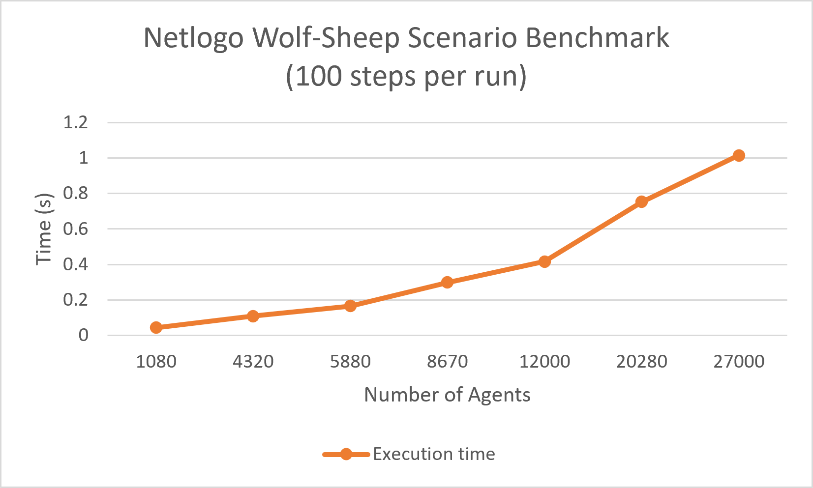

# NetLogo Performance Benchmark

## 1. Experimental Setup

**Environment & Tooling:**
* **System:** Windows 11 Pro
* **Engine:** NetLogo 7.0.2
* **Model:** Wolf Sheep Predation
* **Execution Tool:** BehaviorSpace

**BehaviorSpace Configuration (Performance Optimized):**
* **Update view:** Disabled (to prevent UI rendering overhead)
* **Update plots and monitors:** Disabled
* **Simultaneous runs in parallel:** 1 (sequential execution for accurate wall-clock time)
* **Time limit:** 100 steps (ticks)
* **Repetitions:** 4 per batch

**Model Constants (Applied to all batches):**
* `show-energy?` = false
* `grass-regrowth-time` = 5
* `wolf-gain-from-food` = 20
* `sheep-gain-from-food` = 4
* `sheep-reproduce` = 4
* `wolf-reproduce` = 5
* `model-version` = "sheep-wolves-grass"

**Setup Commands:**
example for the batch 'scale-36':

```netlogo
; Dynamically resize the grid to match the calculated scale
resize-world 0 35 0 35
setup
; Reset the internal timer to track only the simulation execution time
reset-timer
```

## 2. Benchmark Results

## 2. Benchmark Results

| Batch Nr. | Scale | Total Agents | Sheep | Wolves | Grid Dimensions (Max px/py) | Avg Exec Time (s) |
| :--- | :--- | :--- | :--- | :--- | :--- | :--- |
| **1** | 36 | **1,080** | 360 | 180 | 35 | 0.044 |
| **2** | 144 | **4,320** | 1,440 | 720 | 71 | 0.1095 |
| **3** | 196 | **5,880** | 1,960 | 980 | 83 | 0.1655 |
| **4** | 289 | **8,670** | 2,890 | 1,445 | 101 | 0.298 |
| **5** | 400 | **12,000** | 4,000 | 2,000 | 119 | 0.416 |
| **6** | 676 | **20,280** | 6,760 | 3,380 | 155 | 0.753 |
| **7** | 900 | **27,000** | 9,000 | 4,500 | 179 | 1.0145 |

## 3. Visual Representation

